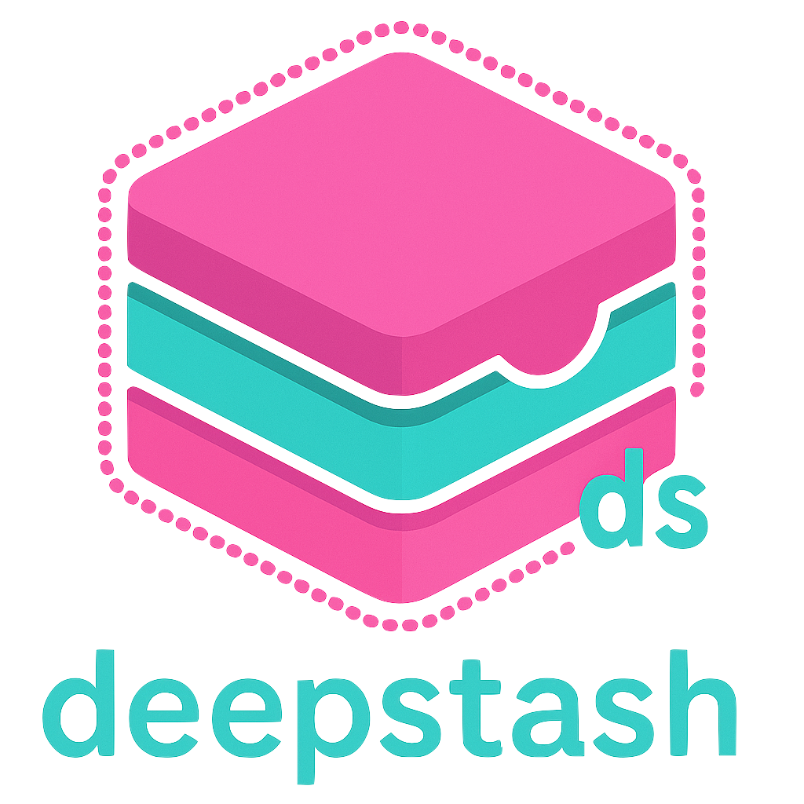

<p align="center">
  
</p>

# 🧳 DeepStash

**DeepStash** is your terminal's secret stash — a vibe-coded utility for archiving files and folders in style. With a single command, you can deepstash clutter out of sight while leaving behind a sleek `.ds` tag as a breadcrumb for revival. Think of it as your digital junk drawer — but organized.

---

## ✨ Features

- 🗂️ **Designate a stash directory** with `--init`  
- 📥 **Deepstash anything** — files, folders, secret plans  
- ♻️ **Restore with confidence** using `.ds` breadcrumbs  
- 🔄 **Collision-proof** — safely handles name conflicts  
- 🔐 **Permission-aware** — gracefully alerts you when stash access is blocked  
- 🎛️ **Vibe-coded CLI** — minimalist, emoji-forward, and terminal-native  

---

## 🔧 Commands at a Glance

| Command | Description |
|---------|-------------|
| `ds --init` | Set your personal stash directory |
| `ds file_or_folder` | Deepstash a file or directory, leaving a `.ds` placeholder |
| `ds file_or_folder.ds` | Restore a stashed item back to its original location |
| `ds --help` | Show usage instructions |
| `pip install .` | Install DeepStash globally from source |

---

## 🚀 Installation

Clone and install locally:

```bash
git clone https://github.com/YOUR_USERNAME/deepstash.git
cd deepstash
pip install .
```

Or install directly from any folder containing the source:

```bash
pip install .
```

---

## ⚙️ Usage

```bash
ds --init                   # Set your stash directory
ds thesis_draft.docx        # Stash the file, leave a .ds tag
ds thesis_draft.docx.ds     # Restore it exactly where it came from
```

---

## 💡 Sample Session

```bash
$ ds --init
📁 Enter deepstash directory path: /Volumes/Archive
✅ Deepstash directory set to /Volumes/Archive

$ ds mixtape.mp3
📦 Stashed: mixtape.mp3 → /Volumes/Archive/mixtape.mp3

$ ls
 mixtape.mp3.ds

$ ds mixtape.mp3.ds
♻️ Restored: /Users/you/Music/mixtape.mp3
```

---

## 🎨 Style Note

This whole utility was vibe-coded — minimalist CLI design, emoji-driven output, and 100% terminal joy. Just enough flair to brighten your `ls`.

---

## 📄 License

Licensed under the [MIT License](LICENSE).